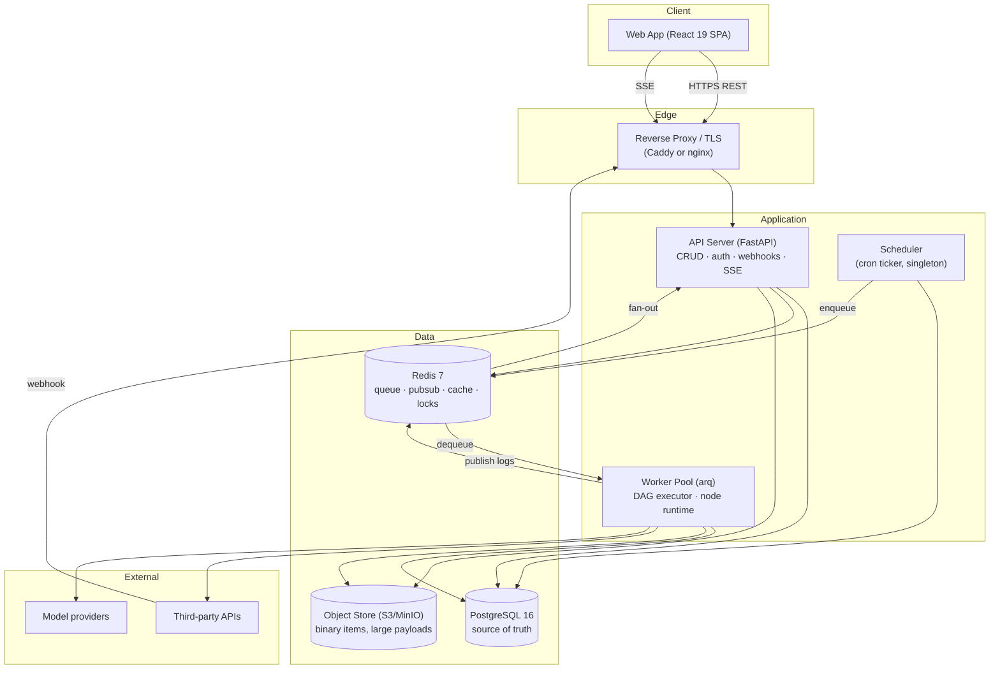
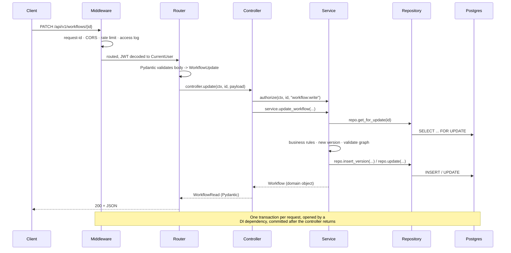
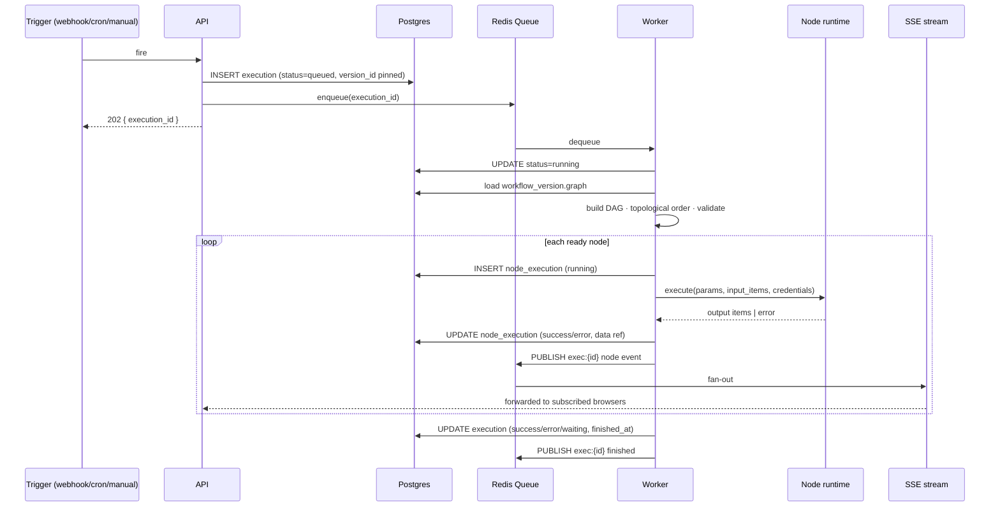

# 03 — System Architecture

## 3.1 Design principles

1. **The API server never runs user code.** Workflow execution is untrusted, unbounded work. It
   lives in worker processes that can be killed, rate-limited, and scaled independently. A
   runaway Code node must never degrade the editor.
2. **One engine, two surfaces.** Agents and workflows compile to the same graph IR and run
   through the same executor. There is no second scheduler. (ADR-001)
3. **Postgres is the source of truth; Redis is disposable.** Losing Redis loses in-flight queue
   position and live log streaming — recoverable. Losing Postgres loses everything. Nothing
   durable is stored only in Redis.
4. **Stateless services.** API and worker hold no session state. Any instance can serve any
   request or job. This is what makes horizontal scaling and rolling deploys trivial.
5. **Boring transport.** REST + JSON for CRUD, SSE for live streams, plain HTTP webhooks for
   ingress. No GraphQL, no gRPC. (ADR-006)

## 3.2 Component map

### Responsibilities, precisely

**Web App.** React 19 SPA. Owns all rendering and editor state. Talks only to the API. Contains
no secrets — credential values are write-only from the client's perspective.

**API Server.** Stateless FastAPI. Owns: authentication, authorization, CRUD over every resource,
webhook ingress, enqueueing executions, and relaying live execution events to browsers over SSE.
It **reads** execution results from Postgres but never computes them. Deployed as N replicas.

**Scheduler.** A small singleton process that ticks every 10 seconds, finds due `schedules` rows,
and enqueues executions. Singleton-ness is enforced by a Redis lock with a TTL, not by deployment
discipline, so two accidental replicas cannot double-fire. Kept separate from the API so that
scaling the API does not multiply cron fires.

**Worker Pool.** Where everything interesting happens: pull a job, load the pinned workflow
version, run the DAG, execute each node's `execute()`, persist per-node results, publish progress.
Workers are the only component that decrypts credentials and the only component that talks to
third parties. Scaled by queue depth.

**PostgreSQL.** All durable state. JSONB for graphs and execution payloads; relational for
identity, ownership, and indexing. See [10](./10-database-schema.md).

**Redis.** Job queue (arq), pub/sub channel per execution for live logs, short-lived caches
(node type registry, OAuth state), distributed locks (scheduler singleton, per-workflow
concurrency), and rate-limit counters.

**Object Store.** Binary node items (files, images) and any execution payload above the inline
threshold. Postgres stores a reference; the bytes live in S3/MinIO. Prevents the classic failure
mode where a workflow that downloads PDFs bloats the primary database. (ADR-009)

## 3.3 Process topology

Minimum viable deployment is five containers:

| Process | Command | Replicas | Scales on |
|---|---|---|---|
| `api` | `uvicorn app.main:app` | 2+ | request rate |
| `worker` | `arq app.worker.WorkerSettings` | 2+ | queue depth |
| `scheduler` | `python -m app.scheduler` | **exactly 1** (lock-guarded) | never |
| `postgres` | — | 1 primary (+ replicas) | vertical, then read replicas |
| `redis` | — | 1 (+ sentinel in HA) | vertical |

The `api` and `worker` images are **identical** — same code, different entrypoint. This is
deliberate: it eliminates the "works in the API, missing in the worker" class of bug entirely.

## 3.4 Request lifecycle (synchronous CRUD)

The path every ordinary API call takes, and the layer each concern belongs to:

Hard rules this diagram encodes:

- **Routers contain no logic.** Path, dependencies, `response_model`, one controller call.
- **Controllers orchestrate; they do not implement.** Authorization, calling one or more
  services, mapping domain objects to response schemas.
- **Services own business rules** and are reusable from HTTP, the worker, and CLI scripts. A
  service function MUST NOT reference `Request`, `Response`, or raise HTTP exceptions.
- **Repositories own SQL.** No business logic. A repository is the only place a `select()` appears.
- **Transaction boundary is the request**, managed by the `get_session` dependency.

Full detail in [08](./08-backend-architecture.md).

## 3.5 Execution lifecycle (asynchronous)

The other half of the system, and the one that defines the product.

**Why the execution row is created by the API, not the worker.** The client needs an ID to
subscribe to *before* the job is picked up, and an enqueue that fails after the row exists is
recoverable by a sweeper; a job that runs with no row is not.

**Suspension.** A Wait node or human-approval node sets the execution to `waiting` with a
`resume_token` and **releases the worker**. Long-lived waits therefore cost no worker slots.
Resume is a fresh job that rehydrates state from `node_executions`. This is what makes UC-3
(approval flows) affordable.

## 3.6 Real-time strategy

**SSE, not WebSockets,** for execution progress. (ADR-015)

- The data flow is one-directional (server to client); WebSockets buy nothing.
- SSE is plain HTTP: it survives proxies, carries auth cookies/headers naturally, and reconnects
  automatically with `Last-Event-ID`.
- `GET /api/v1/executions/{id}/stream` subscribes the API process to the Redis channel
  `exec:{id}` and forwards events. Any API replica can serve any stream because the fan-out
  happens in Redis, not in process memory.

`websockets` remains in `requirements.txt` and is reserved for Phase 5 multiplayer canvas
editing, which *is* bidirectional. `TODO(phase-5)`

## 3.7 Failure behaviour

Designed-for failures and their intended blast radius:

| Failure | Blast radius | Behaviour |
|---|---|---|
| Worker crashes mid-execution | 1 execution | arq re-queues after visibility timeout; completed `node_executions` let it resume rather than restart. Nodes marked non-idempotent are not replayed — the execution fails cleanly instead. |
| Redis dies | live logs + new enqueues | Editor and CRUD keep working. Queued jobs are lost; a reconciler sweeps `queued` executions older than 5 min and re-enqueues on recovery. |
| Postgres primary dies | total | Read-only degradation is not attempted — honest 503 beats a half-working editor. |
| Third-party API times out | 1 node | Per-node timeout, then retry policy, then the error branch or execution failure. |
| A node returns 2 GB of data | 1 execution | Payload cap; the execution fails with a clear message rather than OOM-ing the worker. |
| Model provider rate-limits | 1 node | `tenacity` backoff honouring `Retry-After`, bounded by the node's max retries. |

## 3.8 Performance targets

Budgets, so that "slow" is a bug with a number attached:

| Metric | Target |
|---|---|
| API p95 (CRUD, warm) | < 120 ms |
| Canvas interaction p95 @ 150 nodes | < 100 ms |
| Editor cold load (gzip, no cache) | < 2.5 s TTI |
| Execution pickup latency p95 | < 1 s from enqueue |
| Simple node overhead (engine, excl. I/O) | < 15 ms |
| SSE event delivery p95 | < 300 ms after node completion |
| Executions list @ 1M rows | < 200 ms (index + keyset pagination) |

## 3.9 Boundaries that MUST NOT be crossed

Violations of these are the failure modes that turn layered architectures into mud. They belong
in code review checklists.

1. The API server MUST NOT import the node runtime or execute nodes.
2. The worker MUST NOT import routers or FastAPI request objects.
3. A module's repository MUST NOT be imported by another module. Cross-module access goes through
   the owning **service**.
4. Frontend components MUST NOT call `axios` directly; they call hooks from `endpoints/`.
5. Decrypted credential values MUST NOT appear in a response body, a log line, or an execution
   data payload. Redaction is enforced centrally, not per-node.
6. Nothing durable is written only to Redis.
