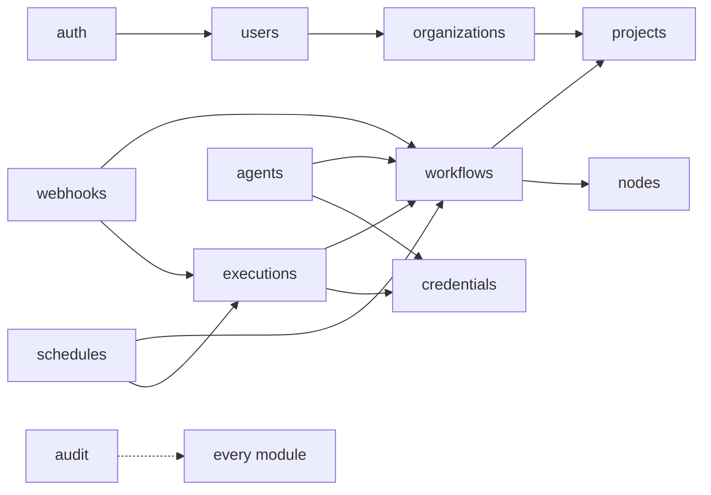

# 09 — Domain Modules

Every module follows the eight-file anatomy from [08](./08-backend-architecture.md) §8.3. This
document defines what each module *owns*, what it exposes, and where the boundaries sit.

## 9.1 The rule that keeps modules honest

> A module owns its tables. Another module may call its **service**, never its repository and
> never its tables.

Violating this is how a modular monolith becomes a regular monolith with extra folders. The
concrete symptom to watch for in review: a `select(Workflow)` appearing anywhere outside
`modules/workflows/repository.py`.

**Dependency direction** (arrows = "may call the service of"):



Cycles are forbidden. If two modules need each other, either the boundary is wrong or a third
module (or a domain event) is missing.

---

## 9.2 `auth`

**Owns:** `refresh_tokens`, `api_keys`, `password_reset_tokens`, `oauth_states`. No user table —
that belongs to `users`.

**Responsibilities:** registration, login, refresh rotation, logout, password reset, API key
issuance/verification, and producing the `RequestContext` every other module authorizes against.

```python
class AuthService:
    async def register(self, email: str, password: str, name: str) -> User
    async def authenticate(self, email: str, password: str) -> TokenPair
    async def refresh(self, refresh_token: str) -> TokenPair     # rotates; detects reuse
    async def revoke_all(self, user_id: UUID) -> None
    async def issue_api_key(self, user_id: UUID, name: str, scopes: list[str]) -> tuple[ApiKey, str]
    async def verify_api_key(self, raw: str) -> ApiKey | None
```

**Notes.** Refresh tokens are rotated on every use and stored hashed; presenting an already-used
token revokes the whole family (theft detection). API keys are shown once at creation and stored
as a SHA-256 hash with a short displayable prefix (`nf_live_a1b2…`) for identification in lists.
Login failures are constant-time and never distinguish "no such user" from "wrong password".

---

## 9.3 `users`

**Owns:** `users`, `user_settings`.

**Responsibilities:** profile CRUD, preferences, avatar, deactivation, and being the only module
that reads or writes the users table.

Deleting a user is a **deactivation**, not a delete: workflows and executions reference the actor,
and cascading a hard delete would destroy audit history. `deleted_at` plus an anonymisation
routine covers GDPR erasure without breaking referential integrity.

---

## 9.4 `organizations`

**Owns:** `organizations`, `organization_members`, `invitations`.

**Responsibilities:** the tenancy root. Every other resource ultimately belongs to an org. Member
management, role assignment, invitations, and the org-level RBAC check.

Roles: `owner` (billing, delete org), `admin` (members, credentials, settings), `member` (build and
run), `viewer` (read). Matrix in [15](./15-security-and-credentials.md) §15.4.

Even in a single-tenant self-hosted install, the org layer exists from day one. Retrofitting
multi-tenancy onto a schema that lacks it is one of the most expensive migrations there is; a
default org costs one row.

---

## 9.5 `projects`

**Owns:** `projects`, `project_members`.

**Responsibilities:** grouping workflows, agents, and credentials within an org. The unit of
access control below the org — a contractor gets access to one project, not the whole org.

Every org gets a "Personal" project by default so the concept is invisible to small teams while
being available to large ones.

---

## 9.6 `credentials`

**Owns:** `credentials`, `credential_shares`, `oauth_tokens`.

**Responsibilities:** encrypted storage of third-party secrets, credential type schemas, OAuth2
authorization-code and refresh flows, connection testing.

```python
class CredentialService:
    async def create(self, ctx, type_: str, name: str, data: dict) -> Credential   # encrypts
    async def get_decrypted(self, credential_id: UUID, *, actor: Actor) -> dict    # WORKER ONLY
    async def test(self, credential_id: UUID) -> TestResult
    async def start_oauth(self, type_: str, redirect_uri: str) -> AuthorizationUrl
    async def complete_oauth(self, state: str, code: str) -> Credential
    async def refresh_oauth_if_needed(self, credential_id: UUID) -> None
```

⚠️ `get_decrypted` is the most dangerous method in the codebase. It MUST be unreachable from any
router — enforced by an import-linter rule, an explicit test asserting no `api/` module reaches it,
and an audit log entry on every call. Full model in [15](./15-security-and-credentials.md).

---

## 9.7 `nodes`

**Owns:** no tables. It is the read-only face of the in-process node registry.

**Responsibilities:** serve the node type catalog (`GET /node-types`), serve individual
descriptors, and run `loadOptions` calls — the dynamic dropdowns that ask a third party "what
Slack channels does this credential see?"

`loadOptions` is the one place the **API** legitimately performs an outbound third-party call.
It is tightly bounded: 10s timeout, results cached in Redis for 5 minutes, no user code, and
rate-limited per credential.

---

## 9.8 `workflows`

**Owns:** `workflows`, `workflow_versions`, `workflow_tags`, `tags`, `pinned_data`.

**Responsibilities:** workflow CRUD, immutable versioning, graph validation, activation
(registering triggers), duplication, and JSON import/export.

```python
class WorkflowService:
    async def create(self, ctx, payload) -> Workflow
    async def update_graph(self, *, workflow_id, graph, actor_id, base_version_id) -> WorkflowVersion
    async def activate(self, workflow_id) -> None    # validates triggers, registers webhooks/schedules
    async def deactivate(self, workflow_id) -> None
    async def duplicate(self, workflow_id, name) -> Workflow
    async def export(self, workflow_id) -> dict      # portable JSON, credentials by ref only
    async def import_(self, ctx, doc: dict) -> Workflow
```

**Activation is a transaction across modules.** Activating validates that exactly one trigger
exists and is configured, then calls `WebhookService.register` and/or `ScheduleService.register`.
If either fails the whole activation rolls back — a workflow that reports "active" with no
registered trigger is a silent data-loss bug.

**Export excludes credential values**, referencing types and names instead. Import maps them onto
existing credentials or flags what is missing. Anything else makes exported workflows a secret-leak
vector the moment someone posts one in a forum.

---

## 9.9 `executions`

**Owns:** `executions`, `node_executions`, `execution_data`.

**Responsibilities:** create and enqueue executions, record results, expose lists/detail with
filtering, cancel, retry, resume suspended runs, and stream live events.

```python
class ExecutionService:
    async def create_and_enqueue(self, *, workflow_id, mode, trigger_data, actor_id) -> Execution
    async def record_node_start(...)  / record_node_finish(...)
    async def finish(self, execution_id, status, error=None) -> None
    async def cancel(self, execution_id) -> None
    async def retry(self, execution_id, *, from_failed_node: bool) -> Execution
    async def resume(self, resume_token: str, payload: dict) -> Execution
```

This is the highest-write-volume module in the system: a 40-node workflow running hourly produces
~350k `node_executions` rows a year. Retention policy, keyset pagination, and the payload
offloading strategy in [10](./10-database-schema.md) §10.7 are load-bearing, not optimisations.

`retry(from_failed_node=True)` reuses successful node outputs and re-runs only from the failure —
the difference between a 2-second fix and re-running a 10-minute pipeline.

---

## 9.10 `agents`

**Owns:** `agents`, `agent_versions`, `agent_runs`, `agent_messages`, `agent_tools`,
`agent_evaluations`.

**Responsibilities:** the agent authoring surface, tool definitions, run history with full message
traces, token/cost accounting, and evaluation sets.

Agents compile to workflow graphs and execute through the same engine (ADR-001), so `agents`
depends on `workflows` and `executions` rather than duplicating them. What it adds is
agent-specific *shape*: message traces, tool-call records, and cost. Detail in
[14](./14-agent-builder.md).

---

## 9.11 `webhooks`

**Owns:** `webhook_registrations`.

**Responsibilities:** map an inbound URL to a workflow and trigger node, verify signatures, and
create the execution.

Two path families:
- `/webhook/{path}` — production, active workflows only.
- `/webhook-test/{path}` — test, live only while the editor is listening, 120s TTL.

The split matters: it lets a user test a webhook from a real third party without activating a
half-built workflow into production.

**Response modes:** `immediate` (202 as soon as it is queued), `last_node` (hold the connection
until the workflow finishes and return its output — bounded by a hard 30s timeout), or
`response_node` (an explicit Respond node controls status, headers, and body).

---

## 9.12 `schedules`

**Owns:** `schedules`.

**Responsibilities:** cron and interval triggers. Stores the expression, timezone, `next_run_at`,
and `last_run_at`.

The scheduler process claims due rows with `SELECT … FOR UPDATE SKIP LOCKED` and advances
`next_run_at` in the same transaction, so a duplicate scheduler cannot double-fire even if the
Redis lock fails. Belt and braces, deliberately — double-firing a billing workflow is not a
recoverable class of bug.

Missed windows (worker down for an hour) do **not** backfill by default. A `catch_up` flag exists
per schedule for the cases where it is genuinely wanted.

---

## 9.13 `variables`

**Owns:** `variables`.

**Responsibilities:** org- and project-scoped key/value config available to expressions as
`$vars.NAME`. Values may be marked secret, in which case they are encrypted at rest and masked in
the UI and in execution logs.

This is what stops people hard-coding environment-specific URLs into node parameters and then
hand-editing them after every export/import between staging and production.

---

## 9.14 `audit`

**Owns:** `audit_logs`.

**Responsibilities:** append-only record of who did what to which resource, with actor, IP, user
agent, and a before/after diff for updates.

Called by every other module through `AuditService.record(...)`. Writes go through the same
transaction as the action, so an audited action that rolls back leaves no phantom log entry.

Audited events: auth (login, failure, key issued), credentials (**every** create/read-decrypt/
update/delete), workflow activate/deactivate/delete, member and role changes, settings changes.

Retention is configurable, minimum 90 days. This module is a hard requirement for Persona D
([01](./01-product-overview.md) §1.5) and is not deferrable to "later".

---

## 9.15 Cross-cutting concerns and where they live

| Concern | Home | Note |
|---|---|---|
| AuthN | `core/security.py` + `api/deps.py` | Produces `RequestContext` |
| AuthZ | `core/permissions.py`, called by controllers | Never in services |
| Encryption | `core/crypto.py` | Used only by `credentials` and `variables` |
| Pagination | `core/pagination.py` | Keyset for high-volume, offset for small sets |
| Rate limiting | `core/middleware.py` | Redis token bucket |
| Logging | `core/logging.py` | structlog, request-id bound |
| Idempotency | `core/idempotency.py` | `Idempotency-Key` on POST |
| Domain events | `core/events.py` | In-process pub/sub for decoupling (Phase 4) |

**On domain events:** deliberately *not* used in v1. In-process events make control flow hard to
follow, and with a dozen modules and explicit service calls the coupling is manageable. They are
introduced only when a genuine fan-out appears (e.g. "on execution failed" needing to notify three
unrelated subsystems). `TODO(phase-4)`
