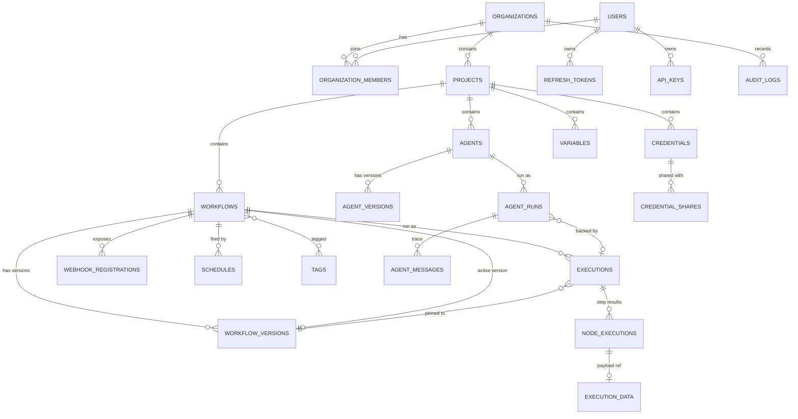

# 10 — Database Schema

PostgreSQL 16. SQLAlchemy 2.0 async ORM. Alembic for every change, without exception.

## 10.1 Entity-relationship overview



## 10.2 Conventions

- **UUIDv7 primary keys.** Time-ordered, so B-tree inserts stay at the right edge (no page splits
  like UUIDv4), while remaining non-enumerable in URLs. (ADR-003)
- `timestamptz`, UTC, always. Never a naive timestamp.
- Tables plural snake_case; FK columns `<singular>_id`.
- Every FK gets an index. Postgres does not create one automatically, and its absence turns
  cascading deletes into sequential scans.
- `created_at` / `updated_at` on every table, `server_default=now()`.
- Soft delete (`deleted_at`) only where restore is a product requirement: workflows, credentials,
  agents, projects, users. Everything else hard-deletes.
- JSONB for graphs, parameters, and payloads. `jsonb`, never `json` — `json` cannot be indexed.
- Money and token counts are integers; durations are integer milliseconds. No floats anywhere a
  human will read the number.

## 10.3 Identity & tenancy

```sql
CREATE TABLE users (
    id             uuid PRIMARY KEY,
    email          citext NOT NULL UNIQUE,
    password_hash  text,                       -- NULL for SSO-only users
    name           text NOT NULL,
    avatar_url     text,
    is_active      boolean NOT NULL DEFAULT true,
    is_superadmin  boolean NOT NULL DEFAULT false,
    last_login_at  timestamptz,
    settings       jsonb NOT NULL DEFAULT '{}',
    created_at timestamptz NOT NULL DEFAULT now(),
    updated_at timestamptz NOT NULL DEFAULT now(),
    deleted_at timestamptz
);

CREATE TABLE organizations (
    id uuid PRIMARY KEY,
    name text NOT NULL,
    slug citext NOT NULL UNIQUE,
    plan text NOT NULL DEFAULT 'self_hosted',
    settings jsonb NOT NULL DEFAULT '{}',
    created_at timestamptz NOT NULL DEFAULT now(),
    updated_at timestamptz NOT NULL DEFAULT now()
);

CREATE TABLE organization_members (
    id uuid PRIMARY KEY,
    organization_id uuid NOT NULL REFERENCES organizations ON DELETE CASCADE,
    user_id uuid NOT NULL REFERENCES users ON DELETE CASCADE,
    role text NOT NULL CHECK (role IN ('owner','admin','member','viewer')),
    created_at timestamptz NOT NULL DEFAULT now(),
    UNIQUE (organization_id, user_id)
);

CREATE TABLE projects (
    id uuid PRIMARY KEY,
    organization_id uuid NOT NULL REFERENCES organizations ON DELETE CASCADE,
    name text NOT NULL,
    description text,
    is_personal boolean NOT NULL DEFAULT false,
    created_at timestamptz NOT NULL DEFAULT now(),
    updated_at timestamptz NOT NULL DEFAULT now(),
    deleted_at timestamptz
);
CREATE INDEX ix_projects_organization_id ON projects (organization_id);
```

`citext` for email and slug gives case-insensitive uniqueness at the database level, which is the
only place it can be guaranteed. Requires `CREATE EXTENSION citext` in the first migration.

**Auth tables:**

```sql
CREATE TABLE refresh_tokens (
    id uuid PRIMARY KEY,
    user_id uuid NOT NULL REFERENCES users ON DELETE CASCADE,
    token_hash text NOT NULL UNIQUE,       -- sha256; raw token never stored
    family_id uuid NOT NULL,               -- rotation lineage; reuse revokes the family
    expires_at timestamptz NOT NULL,
    revoked_at timestamptz,
    user_agent text, ip inet,
    created_at timestamptz NOT NULL DEFAULT now()
);
CREATE INDEX ix_refresh_tokens_user_id ON refresh_tokens (user_id);

CREATE TABLE api_keys (
    id uuid PRIMARY KEY,
    organization_id uuid NOT NULL REFERENCES organizations ON DELETE CASCADE,
    user_id uuid NOT NULL REFERENCES users ON DELETE CASCADE,
    name text NOT NULL,
    key_hash text NOT NULL UNIQUE,
    prefix text NOT NULL,                  -- 'nf_live_a1b2' for display
    scopes text[] NOT NULL DEFAULT '{}',
    last_used_at timestamptz,
    expires_at timestamptz,
    revoked_at timestamptz,
    created_at timestamptz NOT NULL DEFAULT now()
);
```

## 10.4 Workflows and versioning

```sql
CREATE TABLE workflows (
    id uuid PRIMARY KEY,
    project_id uuid NOT NULL REFERENCES projects ON DELETE CASCADE,
    name text NOT NULL,
    description text,
    kind text NOT NULL DEFAULT 'workflow' CHECK (kind IN ('workflow','agent')),
    is_active boolean NOT NULL DEFAULT false,
    active_version_id uuid,                       -- FK added after workflow_versions exists
    settings jsonb NOT NULL DEFAULT '{}',         -- timezone, error workflow, timeouts, concurrency
    created_by uuid REFERENCES users ON DELETE SET NULL,
    created_at timestamptz NOT NULL DEFAULT now(),
    updated_at timestamptz NOT NULL DEFAULT now(),
    deleted_at timestamptz
);
CREATE INDEX ix_workflows_project_id ON workflows (project_id) WHERE deleted_at IS NULL;
CREATE INDEX ix_workflows_active ON workflows (is_active) WHERE is_active;

CREATE TABLE workflow_versions (
    id uuid PRIMARY KEY,
    workflow_id uuid NOT NULL REFERENCES workflows ON DELETE CASCADE,
    version integer NOT NULL,
    graph jsonb NOT NULL,          -- { nodes: [...], edges: [...], viewport: {...} }
    pinned_data jsonb,             -- { nodeId: [items] } — editor-only sample data
    checksum text NOT NULL,        -- sha256 of canonicalised graph; dedupes no-op saves
    note text,
    created_by uuid REFERENCES users ON DELETE SET NULL,
    created_at timestamptz NOT NULL DEFAULT now(),
    UNIQUE (workflow_id, version)
);
CREATE INDEX ix_workflow_versions_workflow_id ON workflow_versions (workflow_id, version DESC);
```

### Why the graph is JSONB (ADR-004)

The obvious alternative is relational `nodes` and `edges` tables. Rejected because:

1. **The access pattern is always "the whole graph."** Nobody queries "all HTTP nodes across all
   workflows" in the hot path. Loading a 60-node workflow becomes 1 row instead of 120.
2. **Versioning becomes trivial.** An immutable version is one row. Relationally it is a deep copy
   of two tables plus ID remapping — a genuinely painful piece of code.
3. **Node parameters are heterogeneous by nature.** They would be JSONB regardless, so the
   relational split buys structure only for `id`, `type`, and `position`.
4. **The client sends and receives whole graphs anyway.** React Flow's model *is* `{nodes, edges}`.

The cost is that cross-workflow node queries need JSONB operators. That is acceptable, and where
it matters we add a GIN index:

```sql
CREATE INDEX ix_workflow_versions_graph_gin ON workflow_versions USING gin (graph jsonb_path_ops);
-- answers "which workflows use credential X / node type Y" for impact analysis
```

### Graph document shape

```jsonc
{
  "nodes": [{
    "id": "n_a1b2",
    "type": "neuroflow.http",           // node type key
    "typeVersion": 2,
    "name": "Fetch customer",           // user-facing, unique within the workflow
    "position": [640, 220],
    "parameters": { "method": "GET", "url": "={{ $json.apiBase }}/c/{{ $json.id }}" },
    "credentials": { "httpHeaderAuth": "cred_uuid" },
    "disabled": false,
    "notes": "…",
    "onError": "stop",                  // stop | continue | continueErrorOutput
    "retryOnFail": { "enabled": true, "maxTries": 3, "waitMs": 1000 }
  }],
  "edges": [{
    "id": "e_1", "source": "n_a1b2", "sourceHandle": "main:0",
    "target": "n_c3d4", "targetHandle": "main:0"
  }],
  "viewport": { "x": 0, "y": 0, "zoom": 1 }
}
```

`sourceHandle` encodes both port type and index (`main:0`, `true:0`, `tool:0`), which is what lets
branch nodes, error outputs, and agent sub-ports share one edge model.

**Node names are the stable reference for expressions** (`$node["Fetch customer"]`). Renaming a
node therefore MUST rewrite expressions across the graph — a server-side service operation, not
something the UI does ad hoc.

## 10.5 Executions

```sql
CREATE TABLE executions (
    id uuid PRIMARY KEY,
    workflow_id uuid NOT NULL REFERENCES workflows ON DELETE CASCADE,
    workflow_version_id uuid NOT NULL REFERENCES workflow_versions,   -- pinned, never null
    project_id uuid NOT NULL REFERENCES projects ON DELETE CASCADE,   -- denormalised for filtering
    status text NOT NULL CHECK (status IN
        ('queued','running','success','error','canceled','waiting')),
    mode text NOT NULL CHECK (mode IN ('manual','trigger','webhook','schedule','retry','sub')),
    trigger_data jsonb,
    error jsonb,                        -- { nodeId, nodeName, message, stack, code }
    resume_token text UNIQUE,           -- set when status='waiting'
    resume_after timestamptz,
    parent_execution_id uuid REFERENCES executions ON DELETE CASCADE,  -- sub-workflows
    retry_of_execution_id uuid REFERENCES executions ON DELETE SET NULL,
    started_at timestamptz,
    finished_at timestamptz,
    duration_ms integer,
    created_by uuid REFERENCES users ON DELETE SET NULL,
    created_at timestamptz NOT NULL DEFAULT now()
);

CREATE INDEX ix_executions_workflow_created ON executions (workflow_id, created_at DESC);
CREATE INDEX ix_executions_project_created  ON executions (project_id, created_at DESC);
CREATE INDEX ix_executions_status_created   ON executions (status, created_at DESC)
    WHERE status IN ('queued','running','waiting');
CREATE INDEX ix_executions_resume_token     ON executions (resume_token) WHERE resume_token IS NOT NULL;
```

The partial index on active statuses is important: it stays tiny (hundreds of rows) even when the
table holds tens of millions, and it is what the worker and the recovery sweeper scan constantly.

```sql
CREATE TABLE node_executions (
    id uuid PRIMARY KEY,
    execution_id uuid NOT NULL REFERENCES executions ON DELETE CASCADE,
    node_id text NOT NULL,              -- graph-local id
    node_name text NOT NULL,            -- denormalised: the version may be gone from cache
    node_type text NOT NULL,
    status text NOT NULL CHECK (status IN ('running','success','error','skipped')),
    run_index integer NOT NULL DEFAULT 0,   -- >0 when a node runs multiple times in a loop
    items_in integer, items_out integer,
    input_data_id uuid REFERENCES execution_data ON DELETE SET NULL,
    output_data_id uuid REFERENCES execution_data ON DELETE SET NULL,
    error jsonb,
    started_at timestamptz NOT NULL,
    finished_at timestamptz,
    duration_ms integer,
    UNIQUE (execution_id, node_id, run_index)
);
CREATE INDEX ix_node_executions_execution_id ON node_executions (execution_id);
```

`run_index` is what makes loops representable: a node inside a loop produces one row per
iteration, so the UI can show "iteration 3 of 7" instead of overwriting history.

## 10.6 Execution payload storage

```sql
CREATE TABLE execution_data (
    id uuid PRIMARY KEY,
    execution_id uuid NOT NULL REFERENCES executions ON DELETE CASCADE,
    kind text NOT NULL CHECK (kind IN ('inline','object')),
    data jsonb,                    -- when kind='inline'
    object_key text,               -- when kind='object' (S3/MinIO)
    size_bytes integer NOT NULL,
    item_count integer NOT NULL,
    truncated boolean NOT NULL DEFAULT false,
    created_at timestamptz NOT NULL DEFAULT now()
);
CREATE INDEX ix_execution_data_execution_id ON execution_data (execution_id);
```

**The threshold rule (ADR-009):** payloads under **64 KB** are stored inline as JSONB. Above that,
bytes go to the object store and only the key is kept. Above the hard cap (16 MB default) the
payload is truncated with `truncated = true` and the UI shows a clear notice.

Without this, the first workflow that downloads PDFs turns the primary database into a file
server, and every `SELECT * FROM executions` becomes a multi-gigabyte read. It is much cheaper to
build this rule on day one than to migrate to it after a customer's disk fills.

## 10.7 Retention

Execution volume is the schema's main scaling risk. Three mechanisms, all required:

1. **Per-project retention policy** — delete executions older than N days (default 30), and
   successful ones sooner than failed ones (failures are what people investigate).
2. **Monthly partitioning of `executions` and `node_executions`** by `created_at`, so pruning is
   `DROP PARTITION` rather than a `DELETE` that bloats and vacuums for hours. Introduced in
   Phase 4, before any deployment reaches ~10M rows. `TODO(phase-4)`
3. **A nightly `arq` cron job** that prunes expired rows and orphaned object-store keys, in
   bounded batches so it never holds a long transaction.

## 10.8 Credentials

```sql
CREATE TABLE credentials (
    id uuid PRIMARY KEY,
    project_id uuid NOT NULL REFERENCES projects ON DELETE CASCADE,
    name text NOT NULL,
    type text NOT NULL,                 -- 'httpHeaderAuth', 'slackOAuth2', 'postgres', …
    encrypted_data bytea NOT NULL,      -- AES-256-GCM ciphertext
    encrypted_dek bytea NOT NULL,       -- data key wrapped by the master key
    nonce bytea NOT NULL,
    key_version integer NOT NULL DEFAULT 1,   -- enables rotation without downtime
    oauth_expires_at timestamptz,
    last_tested_at timestamptz,
    test_status text,
    created_by uuid REFERENCES users ON DELETE SET NULL,
    created_at timestamptz NOT NULL DEFAULT now(),
    updated_at timestamptz NOT NULL DEFAULT now(),
    deleted_at timestamptz,
    UNIQUE (project_id, name)
);
CREATE INDEX ix_credentials_project_id ON credentials (project_id) WHERE deleted_at IS NULL;
```

`key_version` is what makes master-key rotation a background job instead of an outage: new writes
use the new version while old rows are re-wrapped lazily.

## 10.9 Triggers

```sql
CREATE TABLE webhook_registrations (
    id uuid PRIMARY KEY,
    workflow_id uuid NOT NULL REFERENCES workflows ON DELETE CASCADE,
    node_id text NOT NULL,
    path text NOT NULL,                 -- uuid or user-chosen slug
    method text NOT NULL DEFAULT 'POST',
    is_test boolean NOT NULL DEFAULT false,
    expires_at timestamptz,             -- test registrations only
    auth jsonb,                         -- { type: 'none'|'basic'|'header'|'hmac', … }
    response_mode text NOT NULL DEFAULT 'immediate',
    created_at timestamptz NOT NULL DEFAULT now(),
    UNIQUE (path, method, is_test)
);

CREATE TABLE schedules (
    id uuid PRIMARY KEY,
    workflow_id uuid NOT NULL REFERENCES workflows ON DELETE CASCADE,
    node_id text NOT NULL,
    cron text NOT NULL,
    timezone text NOT NULL DEFAULT 'UTC',
    catch_up boolean NOT NULL DEFAULT false,
    next_run_at timestamptz NOT NULL,
    last_run_at timestamptz,
    is_enabled boolean NOT NULL DEFAULT true,
    created_at timestamptz NOT NULL DEFAULT now()
);
CREATE INDEX ix_schedules_next_run ON schedules (next_run_at) WHERE is_enabled;
```

That partial index is the scheduler's entire query plan. It must stay.

## 10.10 Agents

```sql
CREATE TABLE agents (
    id uuid PRIMARY KEY,
    project_id uuid NOT NULL REFERENCES projects ON DELETE CASCADE,
    workflow_id uuid REFERENCES workflows ON DELETE SET NULL,  -- compiled representation
    name text NOT NULL, description text,
    active_version_id uuid,
    created_at timestamptz NOT NULL DEFAULT now(),
    updated_at timestamptz NOT NULL DEFAULT now(),
    deleted_at timestamptz
);

CREATE TABLE agent_versions (
    id uuid PRIMARY KEY,
    agent_id uuid NOT NULL REFERENCES agents ON DELETE CASCADE,
    version integer NOT NULL,
    config jsonb NOT NULL,      -- model, prompt, tools, memory, guardrails, limits
    graph jsonb NOT NULL,       -- canvas representation
    created_by uuid REFERENCES users ON DELETE SET NULL,
    created_at timestamptz NOT NULL DEFAULT now(),
    UNIQUE (agent_id, version)
);

CREATE TABLE agent_runs (
    id uuid PRIMARY KEY,
    agent_id uuid NOT NULL REFERENCES agents ON DELETE CASCADE,
    agent_version_id uuid NOT NULL REFERENCES agent_versions,
    execution_id uuid REFERENCES executions ON DELETE SET NULL,
    status text NOT NULL,
    input jsonb, output jsonb,
    prompt_tokens integer NOT NULL DEFAULT 0,
    completion_tokens integer NOT NULL DEFAULT 0,
    cost_micros bigint NOT NULL DEFAULT 0,     -- micro-USD; integers only
    iterations integer NOT NULL DEFAULT 0,
    stop_reason text,
    started_at timestamptz, finished_at timestamptz, duration_ms integer,
    created_at timestamptz NOT NULL DEFAULT now()
);
CREATE INDEX ix_agent_runs_agent_created ON agent_runs (agent_id, created_at DESC);

CREATE TABLE agent_messages (
    id uuid PRIMARY KEY,
    agent_run_id uuid NOT NULL REFERENCES agent_runs ON DELETE CASCADE,
    sequence integer NOT NULL,
    role text NOT NULL CHECK (role IN ('system','user','assistant','tool')),
    content jsonb NOT NULL,           -- text and/or content blocks
    tool_calls jsonb, tool_call_id text,
    prompt_tokens integer, completion_tokens integer, latency_ms integer,
    created_at timestamptz NOT NULL DEFAULT now(),
    UNIQUE (agent_run_id, sequence)
);
```

`cost_micros` as `bigint` micro-dollars avoids floating-point money entirely. Costs are computed
from a per-model price table at write time, so historical runs keep the price that applied then.

## 10.11 Variables and audit

```sql
CREATE TABLE variables (
    id uuid PRIMARY KEY,
    organization_id uuid NOT NULL REFERENCES organizations ON DELETE CASCADE,
    project_id uuid REFERENCES projects ON DELETE CASCADE,   -- NULL = org-wide
    key text NOT NULL CHECK (key ~ '^[A-Z][A-Z0-9_]*$'),
    value text,                     -- plaintext when is_secret = false
    encrypted_value bytea,          -- when is_secret = true
    is_secret boolean NOT NULL DEFAULT false,
    created_at timestamptz NOT NULL DEFAULT now(),
    updated_at timestamptz NOT NULL DEFAULT now(),
    UNIQUE (organization_id, project_id, key)
);

CREATE TABLE audit_logs (
    id uuid PRIMARY KEY,
    organization_id uuid NOT NULL REFERENCES organizations ON DELETE CASCADE,
    actor_id uuid REFERENCES users ON DELETE SET NULL,
    actor_type text NOT NULL DEFAULT 'user',   -- user | api_key | system
    action text NOT NULL,                      -- 'workflow.activated', 'credential.decrypted'
    resource_type text NOT NULL, resource_id uuid,
    changes jsonb,                             -- { field: { from, to } }, secrets redacted
    ip inet, user_agent text,
    created_at timestamptz NOT NULL DEFAULT now()
);
CREATE INDEX ix_audit_logs_org_created ON audit_logs (organization_id, created_at DESC);
CREATE INDEX ix_audit_logs_resource ON audit_logs (resource_type, resource_id, created_at DESC);
```

The `CHECK` on variable keys enforces `SCREAMING_SNAKE` at the database level, so `$vars` lookups
never have to deal with casing ambiguity.

## 10.12 Alembic policy

**Every schema change is a migration. No exceptions, no manual DDL, in any environment.**

- Naming: `<rev>_<verb>_<subject>.py`, e.g. `a3f1_add_execution_data_object_key.py`.
- **Every migration MUST implement `downgrade()`.** A migration you cannot reverse is a deploy you
  cannot roll back.
- **Always review autogenerate output.** It reliably misses: server defaults, `CHECK` constraints,
  index renames, enum changes, and anything involving JSONB defaults.
- Data migrations are separate revisions from schema migrations. Mixing them makes a partial
  failure unrecoverable.
- Batched backfills for large tables (`UPDATE … WHERE id IN (SELECT … LIMIT 1000)` in a loop),
  never one statement over a hundred million rows.
- `CREATE INDEX CONCURRENTLY` for indexes on populated tables, which requires
  `autocommit_block()` in the migration.
- The first migration enables extensions: `citext`, `pg_trgm` (workflow name search).
- CI asserts `alembic upgrade head` then `downgrade -1` then `upgrade head` succeeds on a fresh
  database, and that `alembic check` finds no un-migrated model changes.

### The expand/contract rule for zero-downtime deploys

Old and new application code run simultaneously during a rolling deploy. Therefore a rename or a
type change is **three deploys**, never one:

1. **Expand** — add the new column, nullable. Deploy code that writes both, reads old.
2. **Migrate** — backfill in batches. Deploy code that reads new.
3. **Contract** — drop the old column, after the previous release can no longer be rolled back to.

Compressing this into one migration is the single most common cause of self-inflicted downtime in
this kind of system.
